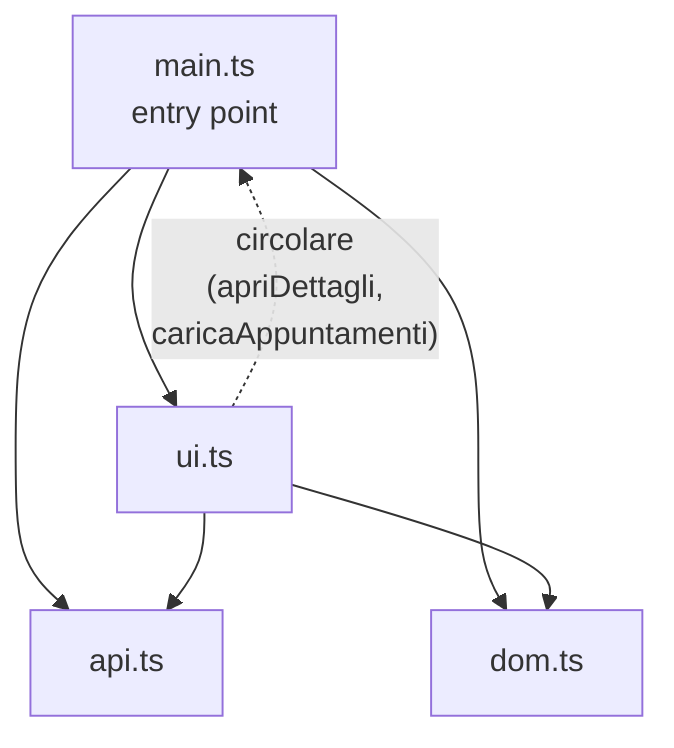
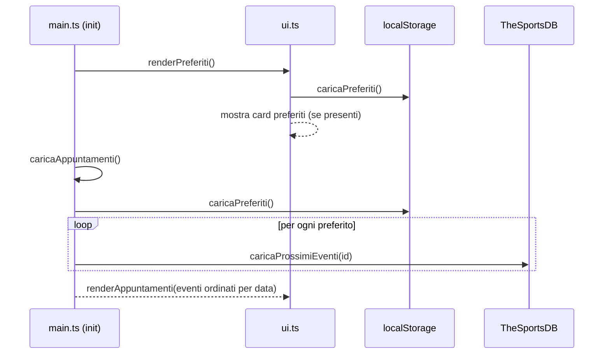
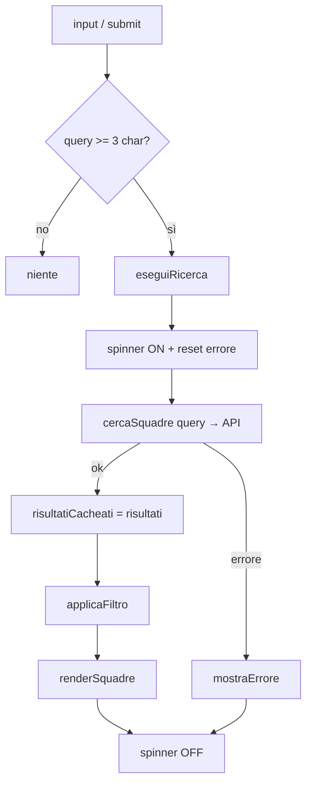
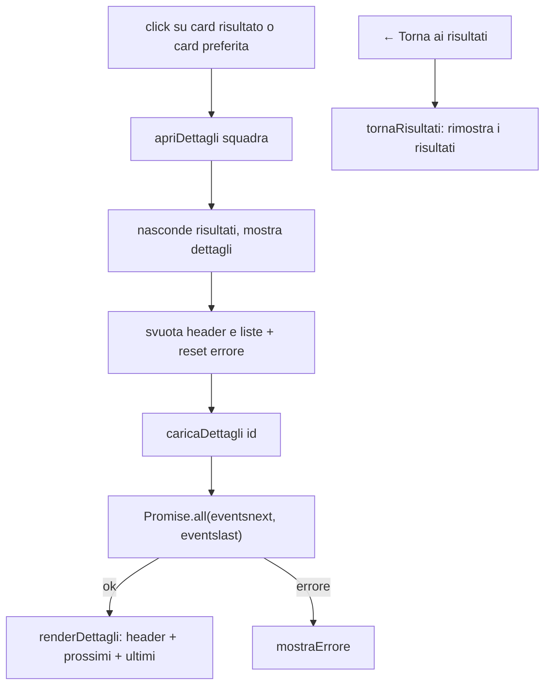
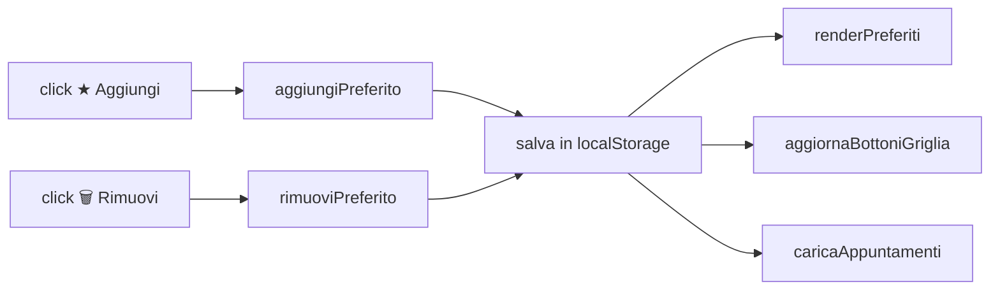

# SportsHub — Documentazione tecnica

Spiegazione completa di **logica, flusso e funzionamento** dell'applicazione dopo il refactoring in TypeScript.

- **Cosa fa:** SPA per cercare squadre sportive (TheSportsDB), vederne prossimi eventi e ultimi risultati, e salvare squadre preferite con aggiornamento automatico dei prossimi appuntamenti.
- **Come è fatta:** TypeScript (ES Modules) → 4 moduli compilati in altrettanti file JS, nessun framework, solo Bootstrap via CDN per lo stile.

---

## 1. Architettura dei moduli

Ogni file `.ts` in [src/](src/) è un **modulo** con `import`/`export`. Prima del refactoring i file condividevano tutto tramite lo *scope globale*; ora ogni modulo dichiara esplicitamente cosa espone e cosa usa.

| Modulo | Responsabilità | Dipende da |
|---|---|---|
| [src/api.ts](src/api.ts) | **Dati**: tipi della risposta API, classi `Squadra`/`Evento`, funzioni `fetch` | nessuno (foglia) |
| [src/dom.ts](src/dom.ts) | **Riferimenti DOM** tipizzati, condivisi fra i moduli | nessuno (foglia) |
| [src/ui.ts](src/ui.ts) | **Vista**: helper DOM, rendering, gestione `localStorage` | `api`, `dom`, `main` |
| [src/main.ts](src/main.ts) | **Controller**: stato, azioni, event listener, avvio | `api`, `dom`, `ui` |

### Grafo delle dipendenze



`main` è l'entry point (è l'unico caricato dall'HTML). `api` e `dom` sono foglie: non dipendono da nulla e non causano cicli.

### La dipendenza circolare `ui ↔ main`

`ui.ts` ha bisogno di due funzioni che vivono in `main.ts` (`apriDettagli`, `caricaAppuntamenti`), e a sua volta `main.ts` importa le funzioni di rendering da `ui.ts`. Questo crea un **ciclo**.

Funziona lo stesso perché quelle due funzioni sono chiamate **solo dentro i gestori di eventi** (al click, non al caricamento del modulo). Quando l'utente clicca, entrambi i moduli sono già stati valutati e i *binding* ESM sono pronti. È un compromesso voluto per restare fedeli al codice originale — vedi *Possibili miglioramenti* nel [README](README.md).

---

## 2. Ordine di caricamento

L'HTML carica un solo file: `<script type="module" src="assets/js/main.js">`. Il *module loader* del browser risolve il resto.

```
1. Il browser scarica main.js  → incontra gli import, li risolve prima di eseguire il corpo
2. import "./ui.js"            → valuta ui.js
     ├─ import "./api.js"      → valuta api.js  (foglia, completa)
     ├─ import "./dom.js"      → valuta dom.js  → esegue getElementById per ogni elemento (*)
     └─ import "./main.js"     → main è già in corso: restituisce i binding (funzioni già hoisted)
3. ui.js finisce (definisce solo funzioni, nessuna chiamata al top-level)
4. main.js prosegue: definisce stato e funzioni, registra i listener
5. main.js in fondo → INIT: renderPreferiti() + caricaAppuntamenti()
```

(*) I moduli `type="module"` sono **deferred**: eseguono dopo il parsing dell'HTML, quindi gli elementi esistono già quando `dom.ts` li cerca. Se un id mancasse, l'helper `el()` lancerebbe subito un errore chiaro invece di propagare `null`.

> **Conseguenza pratica:** gli ES Modules **non** si caricano da `file://` (blocco CORS). Serve un server locale: `npx serve` o *Live Server* di VS Code.

---

## 3. Stato dell'applicazione

Vive in [src/main.ts](src/main.ts), come semplici variabili di modulo:

| Variabile | Tipo | Significato |
|---|---|---|
| `squadraAttiva` | `Squadra \| null` | squadra aperta nella vista dettagli |
| `filtroSport` | `string` | `''` \| `'Soccer'` \| `'Basketball'` \| `'American Football'` |
| `risultatiCacheati` | `Squadra[]` | tutti i risultati dell'ultima ricerca, **non** filtrati |

Il punto chiave è `risultatiCacheati`: la ricerca scarica **tutte** le squadre una volta sola, poi il filtro per sport lavora su questa cache **senza rifare chiamate API**.

---

## 4. Modello dati ([src/api.ts](src/api.ts))

L'API restituisce oggetti "grezzi" con nomi tipo `idTeam`, `strTeam`… Le due classi li traducono in oggetti puliti con nomi in italiano.

### `Squadra`
`id · nome · logo · lega · paese · sport`

### `Evento`
`id · data · ora · casa · trasferta · punteggioCasa · punteggioTrasferta · lega · stagione · stadio · sport`

Con due metodi:

| Metodo | Cosa fa |
|---|---|
| `dataFormattata()` | converte `YYYY-MM-DD` → `DD/MM/YYYY` (o `—` se assente) |
| `risultato()` | `"2 - 1"` se giocata, `null` se non ancora disputata |

I **tipi grezzi** (`SquadraAPI`, `EventoAPI`) descrivono la forma della risposta: i campi sempre presenti sono `string`, quelli che l'API può omettere (logo, punteggi, stadio…) sono `string | null`. Così il compilatore obbliga a gestire i casi mancanti.

---

## 5. Flussi principali

### 5.1 Avvio (INIT)



All'avvio l'app mostra subito le squadre preferite salvate e carica in parallelo i loro prossimi eventi.

### 5.2 Ricerca

Due modi per avviarla, entrambi con **minimo 3 caratteri**:
- **Submit** (Invio o bottone "Cerca") → ricerca immediata.
- **Digitazione** → `debounce` di **400ms**: parte solo quando l'utente smette di scrivere (evita una chiamata a ogni tasto).



`eseguiRicerca` usa `try/catch/finally`: qualunque cosa accada, lo spinner viene spento nel `finally`.

### 5.3 Filtro per sport

I bottoni `.btn-filtro` (Tutti/Calcio/Basket/Football) impostano `filtroSport` e richiamano `applicaFiltro`, che **ri-renderizza dalla cache** senza toccare la rete. Il bottone attivo si evidenzia confrontando l'identità (`b === btn`), senza tenere una lista separata di stati.

> Il filtro è **client-side** di proposito: l'API pubblica non supporta il parametro `&s=`.

### 5.4 Dettagli squadra



`caricaDettagli` lancia le due chiamate (prossimi eventi + ultimi risultati) **in parallelo** con `Promise.all`.

### 5.5 Modal evento

Cliccando una voce evento (nei dettagli o negli appuntamenti) si apre un overlay custom con: data · orario · lega · stagione · stadio · risultato.

Si chiude in **tre modi**: bottone ✕, clic sullo sfondo (`modal-overlay`), tasto **Escape**.

### 5.6 Preferiti (persistenza)

Chiave `localStorage`: **`sportshub_preferiti`** — array di `{ id, nome, logo, lega, paese }` (il campo `sport` non serve nella card, quindi non è salvato).



Ogni modifica ai preferiti fa **tre cose**: aggiorna la sezione preferiti, sincronizza i bottoni "Aggiungi/Preferita" nella griglia risultati, e ricarica gli appuntamenti.

Dettagli importanti:
- `aggiungiPreferito`/`rimuoviPreferito` **rileggono `localStorage`** al click (`ePreferito`), perché lo stato può essere cambiato dopo il render della griglia.
- `stopPropagation` sui bottoni evita di aprire i dettagli mentre si clicca "Aggiungi"/"Rimuovi".
- La card preferita, al click, ricostruisce una `Squadra` dai dati salvati (con `strSport: ""`, non usato in quel percorso) e apre i dettagli **senza rifare la ricerca**.

### 5.7 Appuntamenti

`caricaAppuntamenti` prende i prossimi eventi di **tutti** i preferiti in parallelo con **`Promise.allSettled`**: se una singola squadra fallisce, le altre vengono comunque mostrate. Gli eventi vengono uniti e ordinati per data (`YYYY-MM-DD` → confronto lessicografico corretto).

---

## 6. Gestione degli errori

| Dove | Strategia |
|---|---|
| `fetchJSON` | lancia `Error` se la risposta HTTP non è `ok` |
| `cercaSquadre` / `caricaDettagli` | catturano e rilanciano con messaggio contestuale, mostrato da `mostraErrore` |
| `caricaAppuntamenti` | `Promise.allSettled` → un preferito irraggiungibile non blocca gli altri |
| Logo mancante o rotto | fallback automatico a placeholder testuale 🏆 (listener `error` su ``) |

---

## 7. Sicurezza (XSS)

**Nessun `innerHTML`.** Tutto il DOM è costruito con l'helper `make()`, che usa `document.createElement`, `textContent` e `append`. I dati esterni (nomi squadre, eventi) finiscono sempre in `textContent`, mai interpretati come HTML → nessuna possibilità di injection.

---

## 8. Utility e helper

| Helper | File | Scopo |
|---|---|---|
| `make(tag, attrs, ...figli)` | [ui.ts](src/ui.ts) | crea un elemento tipizzato senza `innerHTML`; il generico lega il tag al tipo restituito |
| `creaLogo(url, alt, class)` | [ui.ts](src/ui.ts) | `` con fallback automatico su errore |
| `debounce(fn, ms)` | [ui.ts](src/ui.ts) | ritarda l'esecuzione (ricerca live) |
| `etichettaPreferito(isPref)` | [ui.ts](src/ui.ts) | testo condiviso dei bottoni preferiti (evita duplicazione) |
| `el(id)` | [dom.ts](src/dom.ts) | recupera un elemento tipizzato, lancia se assente |

---

## 9. Build e compilazione

```
src/*.ts  ──(tsc)──►  assets/js/*.js  +  *.js.map
```

- Config: [tsconfig.json](tsconfig.json) — `rootDir: src`, `outDir: assets/js`, `module: ES2020`, `strict: true`, `sourceMap: true`.
- Comandi: `npm run build` (una volta) oppure `npm run watch` (ricompila a ogni salvataggio).
- Ogni `.ts` produce un `.js` **separato** (compilazione a più file) con lo stesso nome. I `.js.map` permettono di debuggare direttamente sui sorgenti `.ts` nel browser.

---

## 10. Mappa rapida "cosa succede quando…"

| Azione utente | Funzione d'ingresso | File |
|---|---|---|
| Scrive nel campo ricerca | `input` → `ricercaDebounced` → `eseguiRicerca` | [main.ts](src/main.ts) |
| Preme Invio / "Cerca" | `submit` → `eseguiRicerca` | [main.ts](src/main.ts) |
| Clicca un filtro sport | listener `.btn-filtro` → `applicaFiltro` | [main.ts](src/main.ts) |
| Clicca una card squadra | `apriDettagli` | [main.ts](src/main.ts) |
| Clicca "★ Aggiungi/Preferita" | `aggiungiPreferito` / `rimuoviPreferito` | [ui.ts](src/ui.ts) |
| Clicca "🗑 Rimuovi" | `rimuoviPreferito` | [ui.ts](src/ui.ts) |
| Clicca una voce evento | `apriModal` | [ui.ts](src/ui.ts) |
| Chiude il modal (✕ / sfondo / Esc) | `chiudiModal` | [ui.ts](src/ui.ts) |
| Clicca "← Torna ai risultati" | `tornaRisultati` | [main.ts](src/main.ts) |
